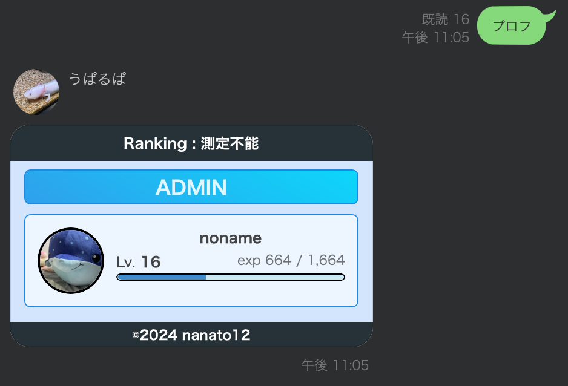

# unofficial LINE Bot うぱるぱ

This bot operates on a **personal account**, not an official LINE account.

Used [CHRLINE](https://github.com/DeachSword/CHRLINE).

You can add this account [here](https://line.me/R/nv/profilePopup/mid=uaf64c300fb85813724ab77a2748502f6).

## Technology

- Python 3.10 - 3.12
- MySQL 5.7
- SQLAlchemy (ORM tool)
- alembic (migration tool)

## Linter & formatter

- black
- isort
- flake8
- mypy

## Usage with command line arguments

```bash
$ python main.py --help

usage: main.py [-h] [-c CONFIG_NAME] [-d DEVICE] [-t TOKEN] [-l LOG_NAME] [-dh DB_HOST] [-dp DB_PORT] [-du DB_USER] [-dpass DB_PASSWORD] [-dd DB_DATABASE]
               [-dc DB_CHARSET]
options:
  -h, --help            show this help message and exit
  -c CONFIG_NAME, --config-name CONFIG_NAME
                        設定名
  -d DEVICE, --device DEVICE
                        デバイス名
  -t TOKEN, --token TOKEN
                        トークン
  -l LOG_NAME, --log-name LOG_NAME
                        ログファイル名
  -dh DB_HOST, --db-host DB_HOST
                        DBのホスト
  -dp DB_PORT, --db-port DB_PORT
                        DBのポート
  -du DB_USER, --db-user DB_USER
                        DBのユーザー名
  -dpass DB_PASSWORD, --db-password DB_PASSWORD
                        DBのパスワード
  -dd DB_DATABASE, --db-database DB_DATABASE
                        DBのデータベース名
  -dc DB_CHARSET, --db-charset DB_CHARSET
                        DBの文字コード
```

## Usage with config file　(recommendation)

```bash
$ cp config.example.json config.json
```

Write configuration information in `config.json`.

If command line arguments are also used, the values of the command line arguments take precedence.

ex.

```json
{
    "default": {
        "device": "IOSIPAD",
        "token": "XXXXXXXXXXXXXXXXXXXXXXXXXXXXXXXXXXXXXXXXXX",
        "log_name": "linebot",
        "db_host": "127.0.0.1",
        "db_port": "13307",
        "db_user": "admin",
        "db_password": "password",
        "db_database": "nanato12_linebot",
        "db_charset": "utf8mb4"
    }
}
```

## Local setup with venv

```bash
$ docker compose up -d
$ python3.12 -m venv venv
$ . venv/bin/activate
(venv) $ make init
(venv) $ make migrate
(venv) $ make run
```

## Operation Example


